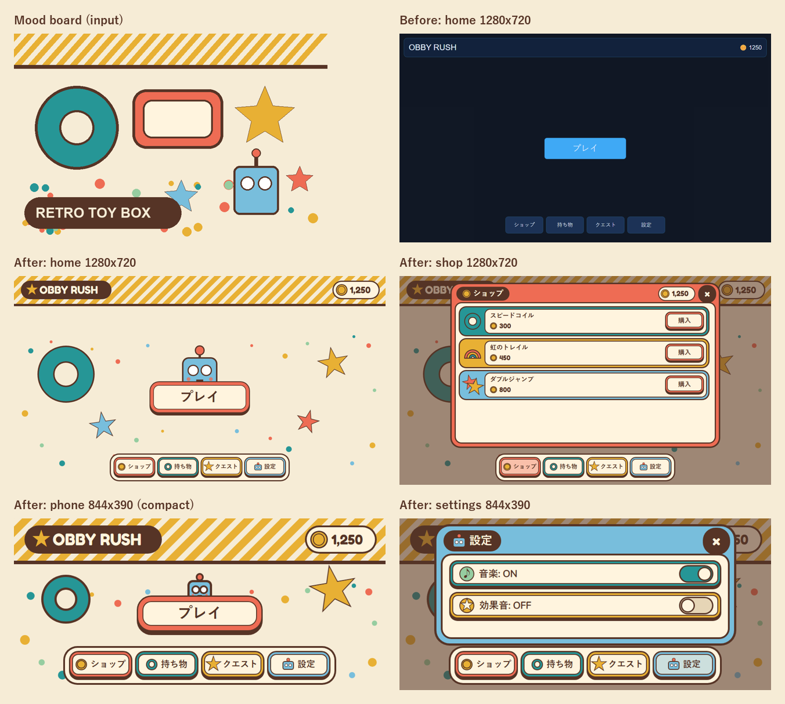

# Obby Rush メインメニュー / ショップ — 「Retro Toy Box」リスキン

入力: `moodboard-retro-toys.png`（ムードボード）と `obby-rush` プロジェクト。
作業はコピー `outputs/obby-rush/` のみで行い、元ファイルは変更していない（`diff -rq` で確認、tests は byte 一致）。

## 1. ムードボードの読み取り

| 要素 | ムードボード上の姿 | UI への翻訳 |
|---|---|---|
| 紙 | 温かいクリーム `#F6ECD6` が画面の 6 割 | 画面背景（不透明。紺の半透明背景を廃止） |
| 線 | こげ茶 `#563426`、太く均一な輪郭（ドーナツで約 6px） | すべての形に 3〜5px のこげ茶 UIStroke。影・グラデーション・グローは使わない |
| 帯 | 上部のマスタード×クリームの斜めストライプ + こげ茶の罫線 | 画面上部の「オーニング」。タイトルとコインがその上に乗る |
| 枠 | コーラル `#EE6C54` の角丸枠 + 内側のクリーム窓 `#FFF4DE` | **ボタンとページの基本形**。色の枠（ベゼル）＋クリームの窓＋こげ茶文字 |
| ラベル | こげ茶のピルにクリーム文字 "RETRO TOY BOX" | タイトル「OBBY RUSH」、各ページの見出しタグ |
| おもちゃ | ティールのドーナツ、マスタード/コーラル/空色の星、空色のロボット | 背景の飾り、タブ/商品アイコン、空状態のイラスト、PLAY から顔を出すマスコット |
| 紙吹雪 | ティール/コーラル/マスタード/ミント `#96CDA0` の丸 | 背景の縁に散らした無輪郭の丸 |

雰囲気は「フラットで太い輪郭のレトロ玩具」。可愛さは装飾の量ではなく、**輪郭・角丸・おもちゃのモチーフ・押し込める積み木ボタン**で出す方針にした。

## 2. デザインの決定と理由

- **文字は必ずクリーム窓の上（こげ茶文字）か、こげ茶ピルの上（クリーム文字）に置く。** 色面（コーラル/ティール）の上に直接文字を置かない。
  コントラスト実測: こげ茶/クリーム窓 10.05:1、クリーム/こげ茶 10.05:1、補助文字 `#7E5E4A`/クリーム窓 5.37:1。
  （参考: こげ茶/ティール 3.07:1、クリーム/コーラル 2.79:1 なので色面直書きは不採用。）
- **ボタン = 積み木。** 色のベゼル + クリーム窓 + 下にこげ茶の台（5〜8px）。押すと台に沈み込み、ホバーで窓が白っぽく明るくなり 1px 浮く。アクティブなタブ（開いているページ）は窓がタブ色の淡色になる。
- **タブ = おもちゃ = ページ色。** ショップ=コーラル+コイン、持ち物=ティール+ドーナツ、クエスト=マスタード+星、設定=空色+ロボット。ページの枠色も同じなので、どのタブのページかが色で分かる。
- **PLAY = おもちゃ箱。** 一番大きなコーラル枠のボタンで、後ろからロボットが顔を出す（ゆっくり上下）。ボタン自体もゆっくり呼吸（1.00→1.035）。画面の主役を一つに絞った。
- **ショップ = おもちゃ棚。** 1 商品 1 段。左の色ベゼルに商品アイコン（スピードコイル=リング、虹のトレイル=虹、ダブルジャンプ=二つ星、未知の ID は順番に既定アイコン）、クリーム窓に商品名・コイン価格、右にコーラルの「購入」積み木。
  段の色はティール/マスタード/空色/ミントを巡回し、コーラルは購入ボタン専用に残した。ヘッダーに所持コイン（`Wallet`、`CoinLabel` の Text を常にミラー）を出し、買い物中に残高が隠れないようにした。
- **設定 = スイッチ付きの積み木。** 「音楽: ON」の文字（従来形式のまま）＋右側に ON(ティール)/OFF(濃クリーム) のスライドスイッチ。
- **空状態**（持ち物・クエスト）は大きなドーナツ / 星のイラスト + 補助文字。
- **ページを開いている間**はこげ茶 45% のスクリムで背景を落とす。ナビのトレイはスクリムより上に残すのでタブ切り替えはそのまま可能。スクリムをタップするとページが閉じる（ページ本体とナビトレイは `Active = true` にしてクリックが下に抜けないようにした）。
- **フォント**: 英数字・数字は FredokaOne（丸くて太い）、ラベルは Nunito ExtraBold/Black。日本語は Roblox の CJK フォールバックで描画されるため、太いウェイトを要求して仮名も太く出るようにしている（下の「未検証」参照）。絵文字 🪙 は使わず、コインは図形で描いた（フラットな画風に合わせるため）。
- **画像アセットは使わない。** ストライプ・星・ドーナツ・ロボット・コイン等はすべて Frame / UICorner / UIStroke / テキストグリフ（★♪、JIS X 0208 収録で日本語フォールバックに必ずある字）で描いた。アップロードや asset ID の管理が不要。
- **モーション**: ロボットの上下、大きな星のゆらぎ、ドーナツの上下、PLAY の呼吸、ページのポップイン（0.9→1 Back）、スイッチのノブ。`GuiService.ReducedMotionEnabled` のときはすべて止める。

## 3. レスポンシブ

- **regular**（高さ 450px 以上）: 720px 高を基準に描き、それより大きい画面では `Background` 全体を UIScale で拡大（s = clamp(min(H/720, W/1280), 1, 2)、Background は 1/s サイズ）。ページも同じ倍率（`PopScale` の静止値 = s）。
- **compact**（高さ 450px 未満 = 横持ちスマホ）: PLAY 280×84、ロボット小さめ、ナビ 60px 高、小さい星を非表示、ページを縦に広げる。タッチ領域はすべて 48px 以上のまま。
- ナビトレイは幅が足りない画面で UIScale 0.75〜1 に縮める。
- `ScreenGui.AbsoluteSize` の変化で再レイアウト（取れない間は `Camera.ViewportSize` で代用）。

プレビュー: 1280×720 / 1920×1080 / 844×390 / 667×375 を出力済み（下記）。

## 4. 名前で参照している他スクリプトとの互換（契約の維持）

- テストが固定している名前はすべてそのまま: `MainMenu`, `PlayButton`, `CoinLabel`, `Nav_Shop/Inventory/Quests/Settings`, `ShopPage/InventoryPage/QuestsPage/SettingsPage`, `Product_<id>` > `BuyButton`, `Toggle_Music`, `Toggle_SFX`, `CloseButton`。
- それに加えて**旧メニューの全インスタンスのパスとクラスを維持**した（`preview_tools/check_paths.py` で旧/新ツリーを比較: 86 パス中 56 が完全一致、残り 30 は各ボタン/TopBar 直下の UICorner・UIStroke という見た目専用の修飾子が Face/Base 側に移っただけ。名前付きインスタンスの欠落・クラス変更は 0）。
  例: `Background.TopBar.CoinLabel`、`ShopPage.ProductList.Product_x.BuyButton`、`SettingsPage.Toggle_Music` は直下の親子関係まで旧版と同じ。飾りは兄弟として足しただけ。
- ボタンは「透明な TextButton（当たり判定・Text の正本）+ 見た目の子」構造。**`button.Text` が正本で、表示ラベルは Text の変更を自動でミラー**するので、外部スクリプトが `BuyButton.Text = "購入済み"` のように書いても表示に反映される。
- `UITheme` の旧 API は互換: `Theme.colors.*` の既存キー（新パレットに再割り当て）、`Theme.font/fontBold`（Enum.Font のまま）、`create/corner/stroke/panel/label/button` の引数と戻り値。新規: `palette`, `fonts`, `tag`, `padding`, `formatNumber`, `idle`, `tween`, `setActive`, `reducedMotion`。
- `MainMenu.open(gui, pageId)` は従来通り。`pageId = nil` で全ページを閉じるようにし（旧版は nil でエラー）、`MainMenu.close(gui)` を追加。
- **表示文字列で変わったもの**（テストは両形式を許容）:
  - `CoinLabel.Text`: `"🪙 1250"` → `"1,250"`（コインは左に図形で描画）。外部が `"🪙 1300"` と書き込んでも表示は崩れないが、コインが二重になる。
  - `Price.Text`: `"🪙 300"` → `"300"`。
  - `CloseButton.Text`: `"閉じる"` → `"×"`（丸い閉じるボタン）。
  - 各ページの `Title` と `Empty` は同じ文言。`PlayButton`「プレイ」、ナビ、購入、「音楽: ON/OFF」も同じ。

## 5. 変更ファイル

- `obby-rush/src/shared/UITheme.luau` — 全面書き換え（パレット、フォント、積み木ボタン、タグ、互換 API）。
- `obby-rush/src/shared/ToyDecor.luau` — 新規（オーニング、紙吹雪、ドーナツ、星、ロボット、アイコン群）。
- `obby-rush/src/client/MainMenu.luau` — 全面書き換え（同じ名前/パス構造でレイアウトとスタイルを刷新、スクリム、ウォレット、レスポンシブ）。
- `obby-rush/README.md` — ToyDecor とテーマの説明を 2 行追加。
- `MenuEntry.client.luau`, `default.project.json`, `tests/*` は無変更。

## 6. 検証したこと

| 検証 | 結果 |
|---|---|
| `lune run tests/test_main_menu.luau`（契約テスト、無改変） | **PASS 29/29**（出力: `preview_tools/test_output.txt`） |
| 旧/新インスタンスツリーのパス・クラス比較（`preview_tools/check_paths.py`） | 名前付きインスタンス欠落 0、完全一致 56/86（残りは見た目専用の修飾子） |
| `rojo build default.project.json`（rojo 7.7.0） | ビルド成功 |
| 見た目のプレビュー | 下記の方法で 17 枚を出力、目視で確認・調整 |
| コントラスト | WCAG 比を計算（上記 §2） |

**プレビューの作り方（近似）**: `preview_tools/dump_tree.luau` が本物の `MainMenu/UITheme/ToyDecor` を契約テストと同じモック上で実行し（画面サイズごと、ページ開閉・トグル・ホバー/押下も実コード経由で操作）、インスタンスツリーを JSON に書き出す。`preview_tools/render_preview.py` がそれを Roblox の GUI 規則の簡易実装（UDim2、AnchorPoint、UIPadding、UIListLayout、AutomaticSize、UIAspectRatioConstraint、UISizeConstraint、UIScale、Rotation、ClipsDescendants、UICorner、UIStroke、TextScaled、Sibling ZIndex）でレイアウトし、Chrome headless で撮影した。フォントはローカルの Roblox インストールにある FredokaOne / Nunito Regular、日本語は Yu Gothic で代用。同じパイプラインで旧版も描画して before 画像にした（`before_*.png`）。

出力画像（outputs 直下）:
- `preview_sheet.png` — ムードボード / before / after の比較
- `preview_home_1280x720.png`, `preview_home_1920x1080.png`, `preview_home_844x390.png`, `preview_home_667x375.png`
- `preview_shop_1280x720.png`, `preview_shop_844x390.png`, `preview_shop_667x375.png`
- `preview_settings_1280x720.png`, `preview_settings_844x390.png`
- `preview_inventory_1280x720.png`, `preview_inventory_844x390.png`, `preview_quests_1280x720.png`, `preview_quests_667x375.png`
- `preview_interact_1280x720.png` — PLAY 押下中 + クエストタブのホバー
- `before_home_1280x720.png`, `before_shop_1280x720.png`
- `preview.html` — 上記を描画する HTML（`?state=shop&w=1280&h=720` のように指定）

## 7. 検証できなかったこと（要 Studio 確認）

**この実行では Roblox Studio を使っていない**（別のジョブが Studio を占有していたため、Studio MCP ツールは一切呼んでいない）。したがって以下は実機未確認で、プレビューは Roblox の実描画ではなく近似である。

- 実際の文字描画: 日本語 CJK フォールバックが要求ウェイト（ExtraBold/Heavy/Bold）を反映して太く出るか。FredokaOne（Regular のみのファミリー）に Bold を要求したとき最寄りの Regular が使われるか。★ ♪ × のグリフ形状と、TextScaled 時の星の実寸。
- UIStroke(Contextual) を星グリフに掛けたときの見え方、UIStroke(Border) の角丸の見え方。
- 回転させたストライプが `ClipsDescendants` の親でクリップされるか（親は無回転なのでクリップされる想定）。
- UIScale がアンカーポイント基準で拡大すること（PLAY の呼吸、ページのポップ、Background の 1/s 手法の前提）、UIAspectRatioConstraint 後のサイズに AnchorPoint が効くこと。
- TextLabel の AutomaticSize が UIPadding を含めて幅を決めること（タイトル/コイン/価格タグの前提）、ScrollingFrame の AutomaticCanvasSize が下パディングを含むか。
- 実機のタッチ操作（押下→離す時の沈み込み復帰、スクロール中の誤タップ）、ゲームパッド選択時の見た目（既定の選択枠との重なり）、キーボードナビ。
- 実画面での再レイアウト（ウィンドウリサイズ、端末回転）と、起動直後に `AbsoluteSize` が 0 の場合のフォールバック。
- パフォーマンス: ホーム画面のインスタンス数は旧 86 → 新 674（ストライプ 96 本、各ボタン約 15 個）。常時動くトゥイーンは 5 本。静的メニューとしては軽い想定だが、低スペック端末では未計測。
- ローカライズ（AutoLocalize）時の表示ラベルのミラー挙動。

## 8. 既知のリスク / 次の一手

- 外部スクリプトが `CoinLabel.Text` に `"🪙 N"` 形式で書き込む場合、コイン図形と絵文字が二重になる → 書き込み側を数字のみにするか、`Theme.formatNumber` を使うのが望ましい。
- 外部スクリプトが旧ボタン直下の `UICorner` / `UIStroke` を名前で触っている場合は効かない（色を変えたい場合は `Face` / `Window` を触る）。
- Studio で確認すべき順: ①日本語の太さ ②星グリフの大きさ ③ストライプのクリップ ④844×390 のエミュレータでのタッチ ⑤ReducedMotion ON。
