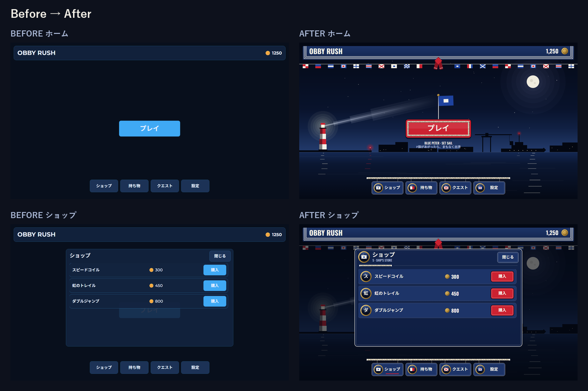

# OBBY RUSH — 「夜の港と海軍」 UI デザインメモ

**コンセプト:** 夜の港に停泊した船の上で、出港の合図を待っているところ。メインメニューは「出港直前の甲板」、
ショップは「船の売店（SHIP'S STORE）」として見せる。対象は `obby-rush/` のメインメニューとショップ
（持ち物・クエスト・設定のページも同じ世界観にそろえた）。

## 色：紺・白・赤＋真鍮（素材としてだけ）

| 色 | 役割 | モチーフ上の意味 |
|---|---|---|
| 紺 `#13244C` ほか 4 段 | パネル・ボタン・夜空・海 | セーラー服のウール地、夜の海 |
| 白 `#F3F0E7` | 文字、パイピング線、ロープ | 襟の白線、白ロープ（純白は使わず少し温かい白） |
| 赤 `#CC2231` | **唯一のアクション色**（プレイ、購入）、選択中タブの下線 | スカーフ、信号旗の赤、港の赤灯 |
| 真鍮 | 丸い金物だけ（舷窓の縁、コイン、ボルト、旗竿の頭） | 「4 色目の UI 色」ではなく素材として扱う |

- 旧テーマの水色アクセント（いわゆる AI っぽい紺×水色）は廃止。緑も使わない（`Theme.colors.success` は白）。
- 危険ボタン（`danger`）は赤塗りにせず「紺地に赤い縁」にして、プレイ／購入の赤と区別。

## モチーフ → UI への翻訳

| モチーフ | どこに | どう作ったか |
|---|---|---|
| **セーラー服** | 上部バー | 左・下・右に**白 3 本線**（セーラーカラー）＋中央から垂れる**赤いスカーフの結び目**（白テープ付き） |
| | パネル・通常ボタン | 紺ウール＋白の外縁＋内側にもう 1 本の白線（襟のパイピング） |
| **信号旗**（国際信号旗） | 上部の旗列 | **満艦飾**。紺・白・赤だけで描ける旗（C E H J N P S U V W X ほか）に限定し、黄・黒を持ち込まない |
| | プレイの上 | **P 旗（ブルーピーター）＝「本船まもなく出港」**を旗竿に掲げ、キャプション「BLUE PETER · SET SAIL」で意味を添える |
| | タブ／ページ見出し | 各タブが自分の旗を持つ：S=Store（ショップ）、H=Hold 船倉（持ち物）、V=Voyage 航海（クエスト、赤い×は「宝の地図の×印」にも読める）、W=Wheel 舵輪（設定）。M と T はアイコンサイズだとスコットランド旗／仏国旗の反転に見えるため避けた |
| | 設定のトグル | ON は **C 旗（Charlie＝YES）**、OFF は **N 旗（November＝NO）**。本物の信号の意味どおり |
| **真鍮の舷窓** | タブ、ページ見出し、商品行、トグル | 旗や商品頭文字を入れる「アイコン窓」。真鍮グラデの縁（UIStroke＋UIGradient）、ボルト、ガラスの映り込み |
| | 所持コイン・価格 | 真鍮の硬貨（絵文字 🪙 を置き換え）。数字は `1,250` 形式 |
| **ロープ** | プレイボタン | 三つ撚りロープの縁取り（グロメット） |
| | タブ | タブはロープの手すりから細索で**吊り下がる**（旗と同じ吊り方） |
| | ページ見出し | 端を白糸で留めた（ホイッピング）ロープの区切り線 |
| | 空の状態 | 持ち物＝甲板に巻いたロープ（フレミッシュコイル）「船倉は空っぽ」、クエスト＝空の揚旗索に「？」の旗 |
| **夜の港** | 背景 | 紺のグラデ空・星・月、赤白の灯台とゆっくり首を振る光線、クレーンと停泊船（舷窓が灯る）のシルエット、防波堤の赤灯、水面の反射 |

- 軍艦旗・旭日旗などの**国籍・軍の旗は使っていない**。登場する旗は国際信号旗（中立の信号）だけ。
- 書体：タイトル・数字・英字キャプションは **Oswald Bold**（艦番号・ステンシル風の細長い大文字）、本文は
  Source Sans Pro。日本語は Roblox の CJK フォールバック。
- 動き：P 旗の揺れ、灯台の光線、星のまたたき、水面のきらめき、ホバー／押下の色とスケール。
  **Reduced Motion が ON なら環境アニメは全部止まる**（`Theme.loop`）。
- ページを開くと港とプレイが少し暗くなり（Scrim）、上部バーとタブは明るいまま。開いているタブには赤い下線。
- 高さ 560px 未満（スマホ横持ち）は**コンパクト表示**：旗竿・キャプション・空状態の絵を隠し、操作系はそのまま。

## 実装

- `src/shared/UITheme.luau` — パレット、フォント、`tween`/`loop`、panel/label/button/piping/gradient。
  旧 API（`Theme.colors` のキー、`button(parent, name, text, onClick, options)` 等）は互換のまま、オプション追加のみ。
- `src/shared/NavalMotif.luau` — 信号旗・舷窓・コイン・ロープ・ロープコイル・襟線・スカーフ。
- `src/client/HarborBackdrop.luau` — 夜の港の背景。
- `src/client/MainMenu.luau` — 画面の組み立て。**テストが固定している名前・コールバック・ページ切替・タッチサイズは不変**
  （`PlayButton`、`CoinLabel`、`Nav_*`、`*Page`、`Product_*`/`BuyButton`、`Toggle_Music`/`Toggle_SFX`、`CloseButton`）。
- 画像アセットは使わず Frame＋UICorner/UIStroke/UIGradient のみ（アップロード不要、どの解像度でもくっきり）。
  代わりにホーム画面は約 1,200 インスタンス（うちロープの撚り 354）。重ければロープの本数を減らすのが第一候補。

## 検証

- `lune run tests/test_main_menu.luau` → **29/29 PASS**（`tests/` は元と完全一致）。`rojo build` も成功。
- Studio は使っていない（指示どおり）。代わりに `tools/preview/` で、**テストと同じモックで実際に `MainMenu.build`
  したインスタンスツリー**をダンプし、Roblox のレイアウト規則（UDim2・AnchorPoint・UIListLayout・UIPadding・
  UICorner・UIStroke・UIGradient・回転と ClipsDescendants の関係）で HTML に再現→ヘッドレス Chrome で撮影。
  文字幅はブラウザ依存なので、最終確認は Studio で 1 度見るのが望ましい。

## プレビュー

- `preview.html` — クリックできるプレビュー（タブ、閉じる、音楽トグル、プレイ、購入）
- `preview_home.png` / `preview_shop.png` / `preview_settings.png` / `preview_inventory.png` / `preview_quests.png`（1280×720）
- `preview_sheet.png`（5 画面一覧）、`preview_sizes.png`（1024×768・1920×1080・844×390）、`preview_before_after.png`
- `preview_dom/` — 各画面の HTML レンダー
